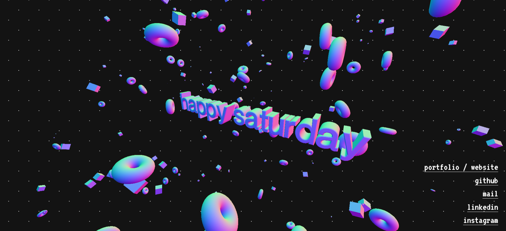

# Three.js 3D Text Animation Website

This website features an interactive 3D text display, incorporating dynamic shapes and animations using Three.js. The project emphasizes responsive design.

## Features

- **Interactive 3D Text**: Displaying random messages in 3D space.
- **Dynamic Shapes**: Includes rotating torus and cube geometries to enhance visual interest.
- **Responsive Design**: Optimized for both desktop and mobile experiences, adjusting controls based on the device.
- **Customizable Textures**: Utilizes Matcap and environmental textures for visual appeal.

## Technologies Used

- **Three.js**: For rendering 3D graphics.
- **GSAP**: For smooth animations and transitions.
- **Custom Fonts**: Imported using `FontLoader` for the 3D text.

## Inspiration

This project is inspired by the stunning website [ilithya.rocks](http://www.ilithya.rocks).